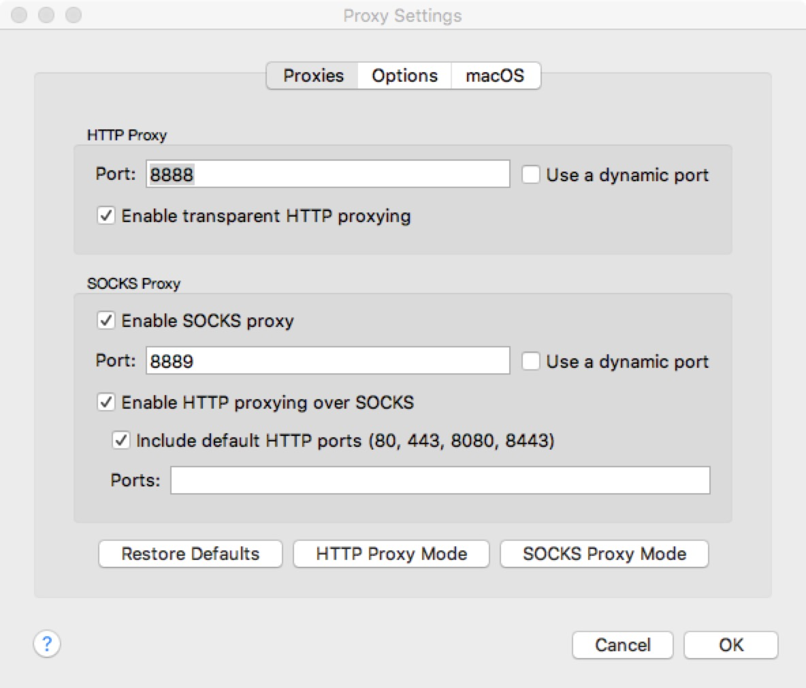
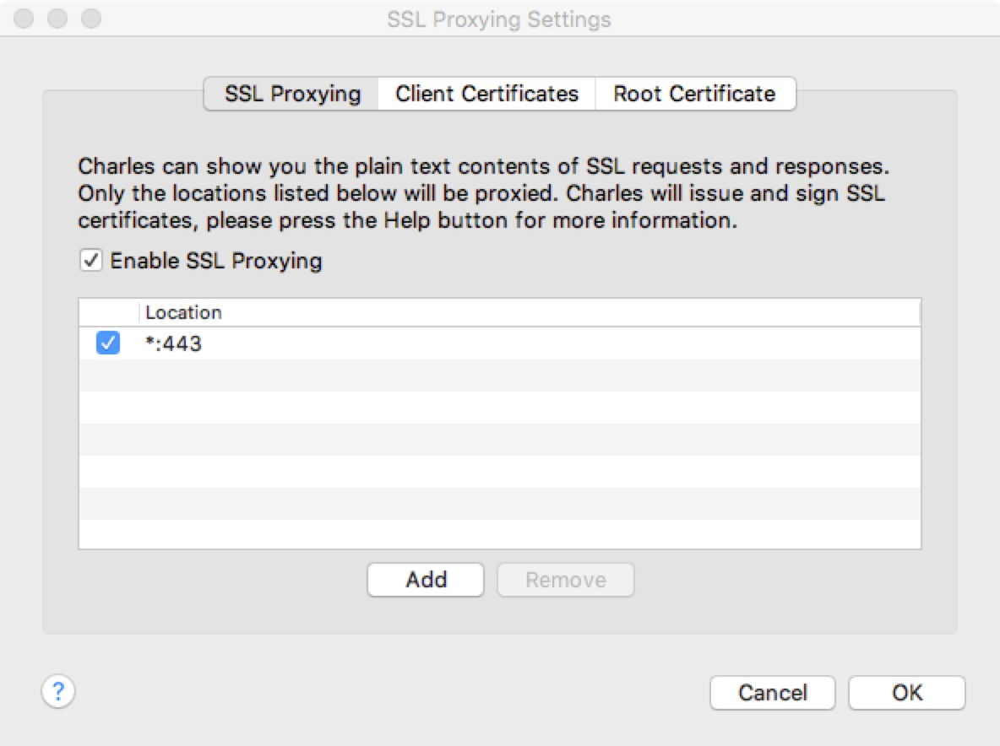
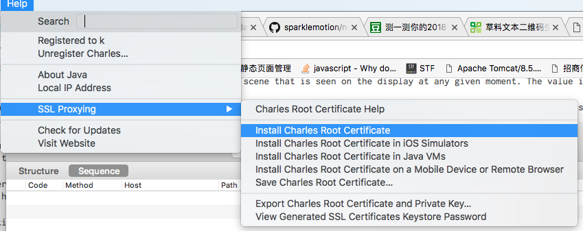

在调试移动网页时，通常开发时会直接使用 chrome 来模拟移动设备。

但毕竟跟真实环境还是有差别，很多问题还是需要到真实设备上才能发现。

以下会列举几种我在开发过程中用到过的几种调试方式，就当做个总结吧。

### Safari

首先是最简单的调试方法，通常在调试 ios 网页上的问题时，最常用的就是用手机连接到电脑，打开 safari ，就可以调试手机上 safari 所打开的网页了。

具体的路径是：

```
safari -> develop -> xxx 的iphone -> 打开的网页
```
点击之后会出现 safari 的控制台，可以在这里查看网络请求、console 输出、dom 结构、样式和打断点等。

使用 safari 比较常见的问题就是，在 menu bar 上会找不到`develop`这个 menu。如果看不到这个 menu 的话，需要在

```
safari -> preferences -> Advanced
```
这个弹出框的最下面有一行

```
Show Develop menu in menu bar
```
把这个勾选上就可以了。

### Charles

通常情况下，Safari 可以解决大部分调试问题，但是一些网络请求相关的问题，还是用 Charles 会比较方便。

这里简单的说一下怎么在 mac 上使用 Charles 查看移动设备上的网络请求。

#### 安装 Charles

要使用 Charles，首先你要有个 Charles。

可以去官网下载试用版，有钱的话，建议直接买个 license 用正式版，毕竟花钱买个舒心。

如果舍不得花这个钱，去网上搜一搜各种破解版本也是有的。

#### 配置 http 代理

按照这个路径

```
Proxy -> Proxy Setting
```
打开 Proxy Setting 的弹窗



1. 配置 Port 为 `8888`
2. 勾选 `Enable transparent HTTP proxying`
3. 勾选 `SOCKS Proxy`，把下面的 Port 设置成 `8889`
4. 勾选 `Enable HTTP proxying over SOCKS`
5. 勾选 `Include default HTTP ports`
6. 点击 `OK` 保存配置

#### 配置 ssl 代理

按照这个路径

```
Proxy -> SSL Proxying Setting
```
打开 SSL Proxying 的弹窗



1. 点击`Add`
2. `Host`填 `*`，`Port`填`443`
3. 点击`OK` 保存端口设置
4. 再点击`OK`保存 SSL 设置

#### 在本地安装 ssl 证书

按照这个路径

```
Help -> SSL Proxying -> Install Charles Root Certificate
```



在本地安装信任证书，并选择`Trust`

#### 在移动设备配置信任证书

按照这个路径

```
Help -> SSL Proxying -> Install Charles Root Certificate on a Mobile Device for Remote Browser
```


点击之后会弹出个对话框：


把这里的地址输入到手机的浏览器中，就会自动下载/安装一个信任证书到手机中。在一些版本的 iOS 设备中，还需要到

```
设置 -> 通用 -> 描述文件
```
中点击一下**信任**

#### 在移动设备中配置代理

按照这个路径

```
设置 -> Wifi(点击网络名称右侧的感叹号) -> Http 代理
```
来到这个界面


把代理的 ip 地址和端口号填进去就可以了。

ip 地址就是使用 Charles 的主机在当前网络中的 ip 地址，如果不清楚的话，可以在 Charles 中按照以下的路径查看

```
Help -> Local Address
```


点击之后会出现一个弹窗


其中 `en0`表示的就是本机在网络中的地址，也就是要在移动设备中填入的 ip 地址。

端口号填[配置 http 代理](#)这里配置的端口号就可以了。

完成以上的配置，就可以在 Charles 中查看到移动设备中的网络请求了。


### iOS WebKit Debug Proxy

除了 Charles 外，最近又发现了一款类似的代理工具，并且是开源的，项目地址可见[ios-webkit-debug-proxy](https://github.com/google/ios-webkit-debug-proxy)。

具体的原理跟 Charles 类似，配置方法相对来说要比 Charles 简单一些，直接按照项目文档中的描述一步步来就可以了，这里就不再描述了。

相较于 Charles ，这个工具更先进的一点是可以指定 chrome devtools 作为调试工具，但是需要额外安装另一个工具[remotedebug-ios-webkit-adapter](https://github.com/RemoteDebug/remotedebug-ios-webkit-adapter)。

